# Diagrams

```py
combos = {
    {"A", "B"}: "1",
    {"A", "B", "C"}: "2",
    {"A", "D"}: "3",
    {"B", "E"}: "4",
}
```

```mermaid
flowchart TB
    S[Start]
    A["A-⬇️"]
    AB["A-⬇️, B-⬇️"]
    AC["A-⬇️, C-⬇️"]
    AD["A-⬇️, D-⬇️"]
    AE["A-⬇️, E-⬇️"]
    AX["A-⬇️, NCK-⬇️"]

    S-- "A-⬇️" -->A

    A -->|"A-⬆️"| S
    A -->|"B-⬇️"| AB
    A -->|"C-⬇️"| AC
    A -->|"D-⬇️"| AD 
    A -->|"E-⬇️"| AE
    A -->|"NCK-⬇️"| AX
    A -->|"⏰"| A 
```




# Combo activator set rules

Ignore ordering for:

* Each activator set has to be unique
    * So it's set of sets basically

## Overlapping activators

Let's ignore ordering for now.
So, {j, k} and {k, j} are the same combo

* Combo: {a, b, c, d, e}
* A sub-combo like {a, b [, c, d]} should be OK
    * After the last key of the sub-combo we check if we either
        1. timeout waiting for next key, or
        2. it is another rando key
        3. next key is one from the super-combo, in which case we forget about the sub-combo, or
    * In cases `1` and `2` we reached the end point of the sub-combo and execute it
    * In case `3` we continue with the super-combo, or if super-combo now completed, execute that instead
* Sub-combo {a, b} -> OK

### What about {a, b} and {b, c}?

OK. No conflicts possible.

### What about {a, b, c} and {b, c, d}?

OK. No conflicts possible.

### What about {a, b, c}, {a, b} and {a, c}?

OK. No conflicts possible.

if b -> a:
    * we ignore `{a, c}` because of the superset-combo
    * we set threshold timeout, if we time out -> we trigger `{a, b}`
    * we get `c` within threshold -> we trigger `{a, b, c}`
    * we get rando key within threshold -> we trigger `{a, b}`

## General rule regarding combos: {a, b, c, d}, {a, b, c} and {c, d}

I think we can say: superset-combos have precedence.
So if we are already in the process towards triggering a combo but we encounter
a smaller subset-combo, this subset-combo is ignored.
E.g. in the state `{a, c, d}` we do not trigger the `{c, d}` combo instead we
try to progress with the superset-combo `{a, b, c, d}`, and if the
superset-combo fails (i.e. through timeout or hitting a random key) then no
subset-combo will be triggered as replacement.

## Ordering

Not yet available

Rules:
* We can't have a ordering-insensitive combo **and** an ordering-sensitive one
    * i.e. {j, k} insensitive and {k, j} sensitive won't work

## Is it possible to have `buffered_key_down_events` when target is sent?

I think not... 🤔 
The buffered keys become a list of keys that need to be released before we
can start looking to make a combo again.
Like: we have j+k+h combo target activated -> we release k and h 
    -> we **cannot** yet press s and expect our `j+s` combo activate (bc j is 
    still down)!!
Or like: j+k+h combo target activated -> let go of `h` or not, either way ->
    we press down `s` and `d` -> can we expect our s+d combo to activate now?
        * definitely not with chording I think bc that's like a new layer
        * with just simul keys? -> prolly easiest to just ignore all other
            combos until all keys for of the activate one have gone UP again.
            also probably a sensible approach I think

Actually maybe it is irrelevant to keep track of the buffered down keys after
target is active **and** the one of the combo keys has already gone up
(triggering the target UP event), setting the target to the 'up' state.
Let's say j+k+h combo is active -> j goes up -> we send 'target'-up
    -> do we still care about k and h being down?
        * physically they have to go UP at some point
        * ⚠️ NOTE: we do trigger an event on the last of the combo keys going up
            * that means we can start looking for new combos again

🚨 We can have two (non-overlapping) combos which could be activated one after the
other. While the first has been activated we could start working towards
activating the second one by pressing one of its combo keys. In this situation
we'd have one active target and one buffered key down event!

# Random stuff

* How to bind to a noop, should we use KEY_RESERVED or KEY_UNKNOWN?
    * maybe both work?
* How do we handle a modifier being held while combo keys are incoming?
    * e.g. for the combo `{j, k} -> Esc` do we still trigger Esc when shift/ctrl/alt/super is held while `j` + `k` get pressed down within the threshold?
    * I would guess we still would, to keep it simple/~stupid~

* Can we intercept the key repeat event? (doesn't seems sadly)
    * This seems to suggest we cannot: https://gitlab.com/interception/linux/plugins/dual-function-keys/-/blob/master/dfk.c#L237 
    * If we cannot block the key repeat event for a certain key then we need to make sure the combo threshold is smaller than the key repeat delay set on gnome/kde/x/sway/etc...
    * Some insight here, section `Repeats`: https://github.com/KarsMulder/evsieve#outputs
        * so I guess most applications (terminal emuls, browsers, w/e) ignore the `input_event.value` `2` (key repeat) and have their own internal logic to handle it. That seems like waste though, but he
        * I suppose this also means that there are a non-zero amount of apps that do rely on this value and don't have their own internal logic to handle key repeats?
        * Also, if most apps don't use/ignore key event value `2` then I assume they rely on the 'normal' down event value `1`? So if we block the down event in `evdev` our app won't see it and cannot trigger its own key repeat logic... ☘️ 🤔
        * Can prevent a key from repeating by:
            * capturing all `down` (event value `1`) and `repeat` (event value `2`) events
            * after we see `x` down for the first time, we store this info
            * subsequent `x` down or repeat events coming in will all be blocked
            * until we see an `x` up event and we which point we allow `x` down and repeat events again? 🙌
            * -> Does not work it seems
            * -> I think bc application record when the first down event for
            *   a key was registered and start generating the key in a repeat
            *   fashion after a delay ms? Not sure
        * What about:
            * Combo `{a, b}` -> `c`
            * When `a` gets pressed we wait for threshold ms
            * i.e. we don't send a down event for `x` 
            * so in theory the app should never know `x` is physically held down?
            * if so, then even if `key-repeat-delay < COMBO_THESHOLD` if should not matter because key repeat delay timer shouldn't get triggered?
            * -> Idk, I guess it's minor issue anyway, we'll see 🚀
